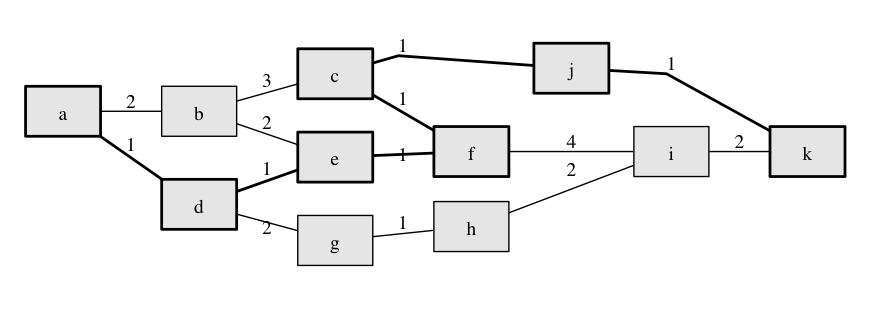

search
======

This is a Clojure library for search algorithms. 

Although it is certainly not yet industrial strength, it intends to be a performant library, meaning that these algorithms are as fast as good Clojure code can be.

Currently implemented
  - [Dijkstra's algorithm](http://en.wikipedia.org/wiki/Dijkstra's_algorithm)
  - [A*](http://en.wikipedia.org/wiki/A*_search_algorithm)
  - [IDA*](http://en.wikipedia.org/wiki/IDA*)

Planned
  - [Theta*](http://en.wikipedia.org/wiki/Theta*)

Example
-------

```clj
[macroz/search "0.3.0"]
```

Using this example problem where the optimal path between "a" and "k" is shown with bold.



```clj
;;    a - 2 - b - 3 - c - 1 - j
;;    |       |       |       |
;;    1       2       1       |
;;    |       |       |       |
;;    d - 1 - e - 1 - f       1
;;    |               |       |
;;    2               4       |
;;    |               |       |
;;    g - 1 - h - 2 - i - 2 - k
```

We can represent the edges like this:

```clj
(def paths-in-one-direction
  {"ab" 2
   "bc" 3
   "cj" 1
   "ad" 1
   "dg" 2
   "de" 1
   "be" 2
   "ef" 1
   "cf" 1
   "gh" 1
   "hi" 2
   "fi" 4
   "ik" 2
   "jk" 1})

(defn reverse-path [[k v]] [(apply str (reverse k)) v])
(def paths (into paths-in-one-direction (map reverse-path paths-in-one-direction)))
```

We can define some additional helpers functions to represent the search problem.

```clj
(def neighbors (apply merge-with concat
                      (map (fn [[[from to] distance]]
                             {(str from) [(str to)]})
                           paths)))
(defn goal= [n] (partial = n))
(def distance (comp paths str))
```

Then we can invoke the search algorithm.

```clj
(dijkstra "a" (goal= "k") distance neighbors 20)
=> ["a" "d" "e" "f" "c" "j" "k"]
```

Also if you provide a heuristic function e.g.

```clj
def heuristic {"a" 3
               "b" 3
               "c" 2
               "d" 3
               "e" 2
               "f" 2
               "g" 3
               "h" 2
               "i" 1
               "j" 1
               "k" 0})
```

Then you can use A*.

```clj
(a* "a" (goal= "k") distance heuristic neighbors 20)
=> ["a" "d" "e" "f" "c" "j" "k"]
```

Also you can search with IDA*.

```clj
(ida* "a" (goal= "k") distance heuristic neighbors))))
=> ["a" "d" "e" "f" "c" "j" "k"]
```

Background
----------

Over the years I have implemented search algoritms in many languages including C++, Java and Racket. This is a library that I hope to include in my Clojure programs, whenever I need to use a search algoritm.

If you have suggestions, let me know!

License
-------

Copyright © 2014 Markku Rontu

Distributed under the Eclipse Public License, the same as Clojure.
